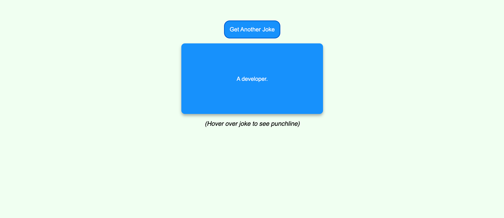
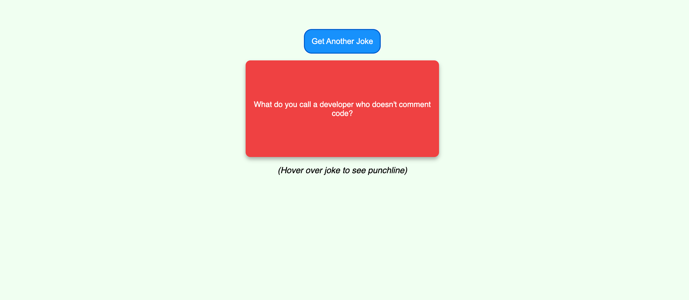

# Joke Cards!

## Description
Sometimes we all just need a quick laugh. Here is just about the simplest app that was ever made for it. Click the button, and a new joke will be displayed on the card. Many jokes will have a set up and a punchline. When you click the button, the set up will display on the card. When you hover over the card, the card will flip over and behind it you will see the punchline! Simple as pie!

## Table of Contents
- [Description](#description)
- [Installation](#installation)
- [Usage](#usage)
- [License](#license)
- [Screenshots](#screenshots)
- [Links](#links)
- [Resources / Credits](#credits)

## Installation
* No installation necessary.

## Usage
* Follow the link to the deployed site below.

## License
Permission is hereby granted, free of charge, to any person obtaining a copy of this software and associated documentation files (the "Software"), to deal in the Software without restriction, including without limitation the rights to use, copy, modify, merge, publish, distribute, sublicense, and/or sell copies of the Software, and to permit persons to whom the Software is furnished to do so, subject to the following conditions:

The above copyright notice and this permission notice shall be included in all copies or substantial portions of the Software.

THE SOFTWARE IS PROVIDED "AS IS", WITHOUT WARRANTY OF ANY KIND, EXPRESS OR IMPLIED, INCLUDING BUT NOT LIMITED TO THE WARRANTIES OF MERCHANTABILITY, FITNESS FOR A PARTICULAR PURPOSE AND NONINFRINGEMENT. IN NO EVENT SHALL THE AUTHORS OR COPYRIGHT HOLDERS BE LIABLE FOR ANY CLAIM, DAMAGES OR OTHER LIABILITY, WHETHER IN AN ACTION OF CONTRACT, TORT OR OTHERWISE, ARISING FROM, OUT OF OR IN CONNECTION WITH THE SOFTWARE OR THE USE OR OTHER DEALINGS IN THE SOFTWARE.

## Screenshots

## Links

* Deployed Link at GH Pages: 
* Github Repository: https://github.com/jonteal/joke-card

## Resources / Credits
* Joke API: https://v2.jokeapi.dev/joke/Any?safe-mode

* Card Flip - W3Schools: https://www.w3schools.com/howto/howto_css_flip_card.asp

* Button animation: Simple CSS Button Hover Effects - Natalia Reshetnikova - CodePen